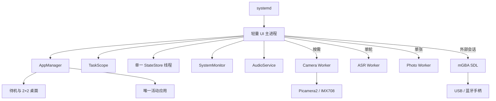

# DeskCamdio v1.0 详细开发指导

> 状态：需求已确认，可直接实施  
> 目标版本：1.0.0  
> 目标硬件：Raspberry Pi Zero 2 W（415MB 可用内存）、480×480 触摸屏、IMX708、EC11、USB/蓝牙手柄  
> Python：3.13.x / ARM64  
> 开发目录：`E:\deskcamdio\v1.0`  
> 原则：Zero 2 W 实机优先，Windows 只承担模拟器和自动测试

## 1. 目标、范围与基线

v1.0 是架构级重写，不继续在 v0.4 上堆叠功能。需要解决：

1. 版本、安装目录、venv 和 systemd 指向不一致。
2. UI 主进程长期持有 Picamera2、NumPy、libcamera、SQLite 和后台任务。
3. 相机与应用反复进入退出后内存和文件描述符增长。
4. 页面、渲染、硬件、存储耦合，核心函数复杂度过高。
5. 缺少依赖锁、覆盖率门槛、实机性能门槛和原子部署。
6. 在全部现有功能上新增 GBA、手柄和 ROM 库。

保留并重写：

- 水族待机、应用桌面和极低功耗；
- 相机、四种滤镜、相册和磁盘缩略图；
- 蓝牙/本地音乐、歌词和音量；
- 本地语音指令、云问答和流式 TTS；
- 钓鱼、备忘、番茄钟和系统设置；
- GBA ROM 库、mGBA、游戏存档和手柄；
- EC11、触控、Wi-Fi、蓝牙、亮度与软关机。

明确不做：

- 不迁移或备份 v0.4 设置、照片、备忘和存档；
- 不删除 `/home/fish/desktop-ai`、`/home/fish/deskcamdio`；
- 不附带或下载商业 ROM、官方 GBA BIOS；
- 不把 Windows 作为正式设备平台。

当前 v0.4 实机基线：

| 指标 | v0.4 | v1.0 发布门槛 |
|---|---:|---:|
| 主进程 PSS | 192MB | 冷启动 ≤115MB |
| 主进程 RSS | 202MB | 冷启动 ≤130MB |
| 文件描述符 | 514 | 冷启动 ≤100 |
| 系统可用内存 | 115MB | 待机 ≥170MB |
| Swap | 已增长 | 常态 ≤16MB |

已确认问题包括周期性 SQLite 连接未显式关闭、已访问应用不销毁、Picamera2 在主进程加载原生库、相机循环遗留 pipe，以及未归属的异步任务。

## 2. 总体架构



UI 主进程只允许常驻：

- Pygame 显示、字体、轻量音效；
- AppManager、主题、通知、导航；
- 一个 SQLite 工作线程；
- 音频状态、GPIO、低频系统状态；
- 待机页与当前应用。

UI 主进程禁止导入：

```text
picamera2
libcamera
numpy
sherpa_onnx
```

这些库只能在可退出 worker 中导入，由操作系统回收。

统一运行状态：

```text
BOOT_LOGO
STANDBY
LAUNCHER
APP
CAMERA_STARTING
VOICE_SESSION
EXTERNAL_GAME
SCREEN_SLEEP
SOFT_SLEEP
SHUTTING_DOWN
```

所有转换由 Runtime 状态机处理。页面不得直接执行 `pygame.quit()`、`systemctl` 或 TTY 切换。

## 3. 推荐源码结构

```text
v1.0/
├── pyproject.toml
├── uv.lock
├── README.md
├── DEVELOPMENT_GUIDE.md
├── LICENSES/
├── src/deskcamdio/
│   ├── _version.py
│   ├── cli/
│   │   ├── device.py
│   │   ├── camera_worker.py
│   │   ├── photo_worker.py
│   │   └── selftest.py
│   ├── core/
│   │   ├── runtime.py
│   │   ├── app_manager.py
│   │   ├── lifecycle.py
│   │   ├── task_scope.py
│   │   └── health.py
│   ├── services/
│   │   ├── state_store.py
│   │   ├── camera_client.py
│   │   ├── audio.py
│   │   ├── voice.py
│   │   ├── system_monitor.py
│   │   ├── game_session.py
│   │   ├── rom_library.py
│   │   └── backend_client.py
│   ├── platform/
│   │   ├── ports.py
│   │   ├── simulator/
│   │   └── raspberry_pi/
│   ├── ui/
│   │   ├── renderer.py
│   │   ├── components.py
│   │   ├── typography.py
│   │   ├── animation.py
│   │   └── themes.py
│   └── apps/
│       ├── standby/
│       ├── camera/
│       ├── gallery/
│       ├── music/
│       ├── gba/
│       ├── fishing/
│       ├── memo/
│       ├── pomodoro/
│       └── settings/
├── tests/
│   ├── unit/
│   ├── integration/
│   ├── simulator/
│   └── hardware_contract/
├── deploy/
│   ├── systemd/
│   ├── requirements-pi.lock
│   ├── wheelhouse/
│   ├── native/aarch64/mgba
│   └── manifests/
└── scripts/
    ├── build_release.ps1
    ├── build_mgba_pi.sh
    ├── deploy_pi.ps1
    ├── install_release.sh
    └── measure_pi.sh
```

禁止提交：

```text
.venv/
.runtime/
*.egg-info/
__pycache__/
.pytest_cache/
.ruff_cache/
work/
dist/
build/
```

## 4. 版本与依赖

唯一版本来源：

```python
# src/deskcamdio/_version.py
__version__ = "1.0.0"
```

`pyproject.toml` 动态读取：

```toml
[project]
name = "deskcamdio"
dynamic = ["version"]
requires-python = ">=3.13,<3.14"

[tool.setuptools.dynamic]
version = {attr = "deskcamdio._version.__version__"}
```

应用描述符只记录 `api_version = 2`，不复制产品版本。禁止提交生成的 `PKG-INFO`。

依赖分层：

- `pyproject.toml`：Python 通用依赖；
- `uv.lock`：完整锁定；
- `deploy/requirements-pi.lock`：ARM64/Python 3.13 精确版本与哈希；
- wheelhouse：每个文件记录 SHA-256；
- Picamera2、gpiozero、lgpio、evdev：Raspberry Pi OS apt 包；
- mGBA：固定源码版本构建的 ARM64 二进制。

Pi venv 必须使用：

```bash
python3 -m venv --system-site-packages /opt/deskcamdio/releases/1.0.0/venv
```

安装后验证：

```bash
venv/bin/python -c "import gpiozero, evdev"
venv/bin/python -c "import deskcamdio; print(deskcamdio.__version__)"
```

主进程测试还要断言：

```python
assert "picamera2" not in sys.modules
assert "numpy" not in sys.modules
assert "libcamera" not in sys.modules
```

## 5. 应用生命周期与资源所有权

### 5.1 App v2

```python
class App(Protocol):
    async def mount(self, context: AppContext) -> None:
        """建立轻量对象，不读大文件、不启动硬件。"""

    async def enter(self, route: RouteState) -> None:
        """成为前台后加载所需数据。"""

    def handle_input(self, event: InputEvent) -> None:
        """只更新状态或发送命令，禁止阻塞 I/O。"""

    def update(self, delta_seconds: float) -> None:
        """纯状态更新，禁止磁盘、网络、数据库和 subprocess。"""

    def render(self, surface: pygame.Surface) -> None:
        """纯渲染。"""

    async def leave(self, reason: LeaveReason) -> None:
        """取消任务并释放大缓存。"""

    async def dispose(self) -> None:
        """注销命令、事件和硬件会话。"""
```

AppManager 规则：

- 待机页可常驻；
- 当前活动应用是唯一常驻业务应用；
- 返回 Launcher 后立即 `leave()`、`dispose()`；
- 音乐、计时等跨页状态属于 Service；
- 模块级变量不得持有 Surface、数据库、线程或进程；
- `leave()` 最长 500ms，超时后由 TaskScope 强制清理；
- 页面异常返回 Launcher，不能退出整个 UI。

### 5.2 TaskScope

所有异步任务、订阅、线程和进程必须登记：

```python
scope.create_task(coroutine, name="gallery-thumbnail")
scope.run_in_thread(function, name="rom-index")
scope.track_subscription(unsubscribe)
scope.track_process(process)
```

`scope.close()` 顺序：

1. 禁止创建新任务；
2. 取消 asyncio task；
3. 调用 unsubscribe；
4. 请求子进程正常结束；
5. 500ms 后 terminate；
6. 再等待 500ms 后 kill；
7. 清空引用并记录残留资源。

禁止应用直接调用裸 `asyncio.create_task()`。

## 6. StateStore 与数据目录

固定目录：

```text
/var/lib/deskcamdio/
├── state.db
├── media/photos/
├── media/thumbnails/
├── music/
├── roms/gba/
├── saves/gba/
└── models/zipformer-small-zh-int8/

/run/deskcamdio/
├── health.json
├── camera.sock
└── camera-worker.pid

/etc/deskcamdio/
├── device.env
└── config.toml
```

只允许 StateStore 拥有 SQLite 连接：

```text
coroutine → async queue → 单 DB 线程 → state.db
```

初始化：

```sql
PRAGMA journal_mode = WAL;
PRAGMA foreign_keys = ON;
PRAGMA busy_timeout = 2000;
PRAGMA synchronous = NORMAL;
```

核心表：

```sql
CREATE TABLE settings (
    key TEXT PRIMARY KEY,
    value_json TEXT NOT NULL,
    updated_at TEXT NOT NULL
);

CREATE TABLE memos (
    id INTEGER PRIMARY KEY,
    body TEXT NOT NULL,
    completed INTEGER NOT NULL DEFAULT 0,
    created_at TEXT NOT NULL,
    updated_at TEXT NOT NULL
);

CREATE TABLE pomodoro_state (
    id INTEGER PRIMARY KEY CHECK (id = 1),
    duration_seconds INTEGER NOT NULL,
    remaining_seconds INTEGER NOT NULL,
    running INTEGER NOT NULL,
    updated_at TEXT NOT NULL
);

CREATE TABLE pomodoro_daily (
    day TEXT PRIMARY KEY,
    completed_count INTEGER NOT NULL DEFAULT 0
);

CREATE TABLE fishing_state (
    id INTEGER PRIMARY KEY CHECK (id = 1),
    state_json TEXT NOT NULL,
    updated_at TEXT NOT NULL
);

CREATE TABLE fishing_collection (
    species TEXT NOT NULL,
    size TEXT NOT NULL,
    rare INTEGER NOT NULL,
    first_caught_at REAL NOT NULL,
    count INTEGER NOT NULL,
    PRIMARY KEY (species, size, rare)
);

CREATE TABLE gba_roms (
    sha256 TEXT PRIMARY KEY,
    path TEXT NOT NULL UNIQUE,
    title TEXT NOT NULL,
    game_code TEXT NOT NULL,
    size_bytes INTEGER NOT NULL,
    mtime_ns INTEGER NOT NULL,
    last_played_at TEXT
);
```

迁移使用 `schema_migrations`，每个迁移独立事务。v1.0 不读取 v0.4 数据。

待机汇总不得自行连接其他数据库。StateStore 在变更后发布：

```text
memo.changed
pomodoro.changed
photo.created
music.changed
system.changed
```

DashboardService 维护只读内存快照。

## 7. Camera Worker

### 7.1 生命周期

```text
进入相机
→ 显示 Fish 光圈/自动对焦动画
→ spawn camera worker
→ 等待 socket ready，最长 2.5 秒
→ 打开 IMX708 双码流
→ 第一帧到达后淡入预览

离开相机
→ UI 立即执行退出动画
→ 发送 close
→ 等待 1 秒
→ terminate
→ 再等 1 秒后 kill
→ 删除 socket 和 pid 文件
```

主进程永远不调用 `Picamera2()`。

### 7.2 IPC

使用 `/run/deskcamdio/camera.sock`。消息格式：

```text
4 字节大端 header_length
header_length 字节 UTF-8 JSON
header.body_length 字节二进制 body
```

公共 Header：

```json
{
  "type": "request|response|event",
  "name": "open|ready|preview|capture|capture_done|close|error|ping",
  "id": "uuid",
  "body_length": 0,
  "timestamp": 0.0
}
```

预览：

- 640×360；
- 8 FPS；
- JPEG quality 72；
- 单帧最大 256KiB；
- UI 忙时丢弃旧帧，只保留最新帧。

拍照请求：

```json
{
  "type": "request",
  "name": "capture",
  "id": "uuid",
  "quality": "low|medium|high",
  "destination": "/var/lib/deskcamdio/media/photos/.capture-uuid.jpg.part"
}
```

档位：

| 档位 | 分辨率 |
|---|---|
| low | 1536×864 |
| medium | 2304×1296 |
| high | 4608×2592 |

完成流程：

1. 检查文件非空；
2. `fsync()`；
3. 原子重命名为最终 `.jpg`；
4. 返回尺寸、字节数和耗时；
5. UI 播放快门并刷新真实上一张缩略图；
6. 滤镜另启 Photo Worker，不阻塞预览。

异常规则：

- 没有 IMX708：显示错误但允许返回；
- worker 崩溃：清理 socket，提供重试；
- 拍照超时：删除 `.part`，保留预览；
- 拍照过程中离页：最多等 2 秒完成落盘；
- 滤镜失败：原始 JPEG 必须保留。

## 8. 语音、图片和网络

语音参数固定：

- 16kHz、S16_LE、单声道；
- 100ms 音频块；
- RMS 420；
- 说话后静音 700ms；
- 无人声 2 秒；
- 最长 8 秒；
- Zipformer worker 每轮退出；
- 本地确定性指令优先；
- 云问答继续使用现有 `/v1` API。

限制：

- 历史最多 6 条、1200 字；
- 输入最多 300 字；
- 回复最多 120 字；
- 动作最多 3 个；
- TTS 最大 8MiB。

Photo Worker 每次只处理一张照片，通过临时文件完成原子替换，30 秒超时。失败不得删除原片。

BackendClient 懒创建连接池，离线使用不创建 HTTP 客户端。修复源码中所有乱码提示。

## 9. UI 规范

### 9.1 主题

内置：

1. `fish`：默认，红/黑/白；
2. `aquatic`：水族蓝灰；
3. `cream`：暖日奶油；
4. `graphite`：石墨黑。

主题只改变 Token，不改变布局和交互：

```python
@dataclass(frozen=True)
class ThemeTokens:
    background: Color
    surface: Color
    surface_elevated: Color
    text_primary: Color
    text_secondary: Color
    accent: Color
    danger: Color
    warning: Color
    stroke: Color
    shadow_alpha: int
```

### 9.2 字体与命中区域

- 正文 ≥17px；
- 次级文字 ≥14px；
- 按钮文字 ≥16px；
- 最小点击区域 48×48；
- 正文与歌词自动换行；
- 只有文件名、设备 id 可用省略号；
- 文本 LRU 最多 512 项；
- 主题切换清理颜色相关缓存。

### 9.3 导航

待机页点击或上滑进入 Launcher。Launcher 为 2×2 图标并水平翻页：

```text
第 1 页：相机 / 相册 / 音乐 / GBA
第 2 页：钓鱼 / 备忘 / 番茄钟 / 设置
```

手势：

- 横向位移 ≥60px 或速度 ≥500px/s：翻页；
- 未达阈值：回弹；
- 点击图标：进入应用；
- 应用返回：Launcher；
- Launcher 下滑或返回：待机。

动画：

- 页面切换 180–240ms；
- 主题淡变 220ms；
- 相机预热 1–2 秒 Fish 光圈动画；
- 低功耗模式只保留一条鱼，5 FPS；
- 动画期间禁止创建全屏临时 Surface。

### 9.4 EC11

| 场景 | 转动 | 短按 | 长按 |
|---|---|---|---|
| 普通页面 | 音量 | 语音 | 软休眠 |
| 相机 | 音量 | 快门 | 软休眠 |
| GBA | 音量 | 紧急返回 | 退出游戏后软休眠 |
| 息屏 | 唤醒并调音量 | 唤醒 | 唤醒 |

## 10. 应用要求

### 相机与相册

- 原片、CCD、徕卡、黑白；
- 高中低分辨率；
- 最新照片缩略图必须来自刚保存文件；
- 磁盘缩略图缓存；
- 缩略图单 worker 解码；
- 内存缩略图 LRU ≤32；
- 查看器只缓存当前和相邻两张；
- 删除原图同时删除缩略图。

### 音乐

- 蓝牙手机音乐和本地 mp3/ogg/wav；
- 音乐播放时普通按键音为 28%；
- 闹钟、错误和快门保持原音量；
- 歌词换行；
- 页面销毁后播放状态由 AudioService 保持。

### 钓鱼

保留鱼种、稀有鱼、QTE、仓库、商店、图鉴和时段生态。离页提交状态并释放全部鱼、装饰与缓存 Surface。

### 备忘和番茄钟

全部写入 StateStore。TimerService 持有计时状态，页面销毁不影响计时。通知由全局服务发出。

### 设置

页面分组：

- 显示与主题；
- 声音；
- Wi-Fi 与蓝牙；
- 相机；
- 手柄；
- GBA；
- 设备与电源；
- 系统诊断。

系统诊断显示版本、PSS/RSS/FD、内存、Swap、worker、Wi-Fi、蓝牙、音频、触控、GPIO、IMX708、手柄和最近错误。

## 11. GBA 与手柄

### 11.1 mGBA

使用轻量 SDL mGBA，不使用 RetroArch。官方支持 Linux、SDL 手柄、内置高层 BIOS与游戏存档：

- [mGBA 官方仓库](https://github.com/mgba-emu/mgba)
- [mGBA 命令行说明](https://github.com/mgba-emu/mgba/blob/master/doc/mgba.6)

固定源码版本和提交 SHA，构建要求：

- 只启用 GBA core 和 SDL；
- 禁用 Qt、FFmpeg、Lua、调试器、录像；
- 不启用 shader、rewind、视频滤镜；
- ARM64 Release；
- 附带 MPL-2.0 许可证；
- 发布包校验二进制 SHA-256。

SDL 前端动态链接 `libmgba.so.0.10`：**发布包必须同时携带该共享库**（与 `mgba` 二进制同目录，
并建 `libmgba.so.0` / `libmgba.so` 软链），且对二进制执行
`patchelf --set-rpath '$ORIGIN'`，否则部署后 `GameSession.start()` 会因
`libmgba.so.0.10: not found`（退出码 127）立即失败。构建脚本 `build_mgba_pi.sh` 已负责这两步，
重建后请用 `ldd mgba` 确认能解析到同目录的 `libmgba.so.0.10`。

默认使用 mGBA 内置 BIOS。项目不提供官方 BIOS。

### 11.2 ROM

唯一导入方式：

```powershell
scp .\game.gba fish@192.168.1.17:/var/lib/deskcamdio/roms/gba/
```

只接受：

- 普通 `.gba` 文件；
- 1KiB–64MiB；
- 解析路径位于 ROM 根目录；
- Header 标识有效。

索引：

1. SHA-256；
2. 解析标题和 game code；
3. 写入 `gba_roms`；
4. 同哈希去重；
5. 生成本地文字封面，不联网。

### 11.3 游戏存档

只使用游戏自身 `.sav`：

```text
/var/lib/deskcamdio/saves/gba/<rom-sha256>/
```

不提供即时存档、自动状态和自动续玩。

退出：

1. 请求 mGBA 正常退出；
2. 等 3 秒写 `.sav`；
3. 超时 terminate；
4. 再等 1 秒后 kill；
5. `fsync()` 保存目录；
6. 恢复 Fish UI。

### 11.4 显示和音频

启动前：

1. 停止 Camera/ASR；
2. 暂停音乐；
3. 关闭 Pygame mixer；
4. 释放 Pygame KMS display；
5. 240ms 黑场；
6. 启动 mGBA SDL。

GBA 240×160 固定 2×缩放为 480×320，上下各 80px 黑边，不拉伸。

退出后重新初始化 display 和 mixer，显示红色 Fish Logo，返回 ROM 页。音乐保持暂停。

### 11.5 手柄

- USB 和蓝牙热插拔；
- 标准 SDL mapping 自动识别；
- 未识别手柄在设置中校准；
- mapping 按 GUID 保存并通过 `SDL_GAMECONTROLLERCONFIG` 传递；
- 无兼容手柄时禁止启动 ROM。

映射：

```text
A/B → GBA A/B
L1/R1 → GBA L/R
Start/Select → GBA Start/Select
D-Pad → 方向
左摇杆 → 可选方向别名
```

正常退出：

```text
L1 + R1 + L2 + R2 同时保持 1 秒
```

GameSession 用 evdev 旁路监听，不独占设备。缺少 L2/R2 的手柄显示“不兼容退出组合”。

断开处理：

- 立即暂停 mGBA；
- 30 秒内同 GUID 重连则继续；
- 超时返回 Fish；
- EC11 短按可紧急返回；
- EC11 长按先结束 mGBA 再软休眠。

## 12. systemd 与原子部署

固定布局：

```text
/opt/deskcamdio/releases/1.0.0/
/opt/deskcamdio/current -> releases/1.0.0
/var/lib/deskcamdio/
/etc/deskcamdio/
/run/deskcamdio/
```

systemd 只引用 `current`：

```ini
[Service]
User=fish
Group=fish
SupplementaryGroups=video render input audio gpio bluetooth
WorkingDirectory=/opt/deskcamdio/current
EnvironmentFile=-/etc/deskcamdio/device.env
ExecStart=/opt/deskcamdio/current/venv/bin/deskcamdio-device
Restart=on-failure
RestartSec=3
WatchdogSec=20
StandardInput=tty
TTYPath=/dev/tty1
```

禁止出现：

```text
/home/fish/desktop-ai
/home/fish/deskcamdio
DESKTOP_AI_*
desktop-ai-sim
```

发布包包含 wheel、锁文件、ARM64 wheelhouse、mGBA、systemd、Plymouth、配置、SHA 清单和许可证；不得包含 venv、运行数据库、ROM、BIOS、照片、Token 或 Windows 路径。

原子安装：

1. 上传完整 rc2 源包与 wheelhouse；
2. 校验 SHA；
3. 创建最终版本目录，在最终路径建立 venv 并离线安装 wheel；
4. 在最终路径执行 import、shebang 与 headless 冒烟；
5. mGBA 自包含检查：`libmgba.so.0.10` 必须随包且可被 `mgba` 加载，缺库即失败
   （否则 `GameSession.start()` 以退出码 127 秒挂）；
6. 安装唯一 service；
7. 全部检查通过后才原子替换 `current`；失败删除本次未启用目录，保留所有旧 release。
10. 确保数据目录 `/var/lib/deskcamdio` 与 `/run/deskcamdio` 归运行用户（fish）所有
    （`chown -R fish:fish`），否则 StateStore 写入会因 `state.db` 属主为 root 报
    “readonly database”。`install_release.sh` 第 9 步已包含此操作。
11. 启动并观察 60 秒；
12. 失败则恢复旧服务路径。

旧代码和旧数据不迁移、不备份、不删除。

## 13. 日志与健康状态

日志使用 journald 键值格式：

```text
event=app_enter app=camera duration_ms=35
event=camera_worker_started pid=1234 duration_ms=420
event=camera_worker_stopped reason=navigation fd_delta=0
event=game_started rom_sha=... controller_guid=...
event=game_stopped reason=shoulder_combo exit_code=0
```

不得记录 Token、完整对话、音频、备忘录正文或 ROM 内容。

`/run/deskcamdio/health.json` 每 5 秒更新：

```json
{
  "version": "1.0.0",
  "active_app": "standby",
  "mode": "STANDBY",
  "rss_kb": 0,
  "pss_kb": 0,
  "fd_count": 0,
  "available_memory_kb": 0,
  "swap_used_kb": 0,
  "workers": {},
  "last_frame_ms": 0,
  "last_error": ""
}
```

## 14. 代码质量

- UTF-8、LF；
- Ruff format 零差异；
- Ruff lint 零错误；
- 圈复杂度 ≤10；
- core/services/platform 接口通过 mypy；
- 除故障边界外禁止裸 `except Exception`；
- 单函数建议 ≤60 行；
- core 单文件 ≤400 行；
- render/update 禁止 I/O；
- 所有缓存有上限和清理方法；
- 所有 task、thread、FD、socket、数据库和 process 有唯一所有者；
- Token 只来自 EnvironmentFile。

质量命令：

```powershell
uv run ruff format --check src tests
uv run ruff check src tests
uv run mypy src/deskcamdio/core src/deskcamdio/services src/deskcamdio/platform
uv run pytest --cov=deskcamdio --cov-branch --cov-fail-under=85
```

覆盖率：整体 ≥85%，core/services ≥90%。

## 15. 测试与验收

自动测试必须覆盖：

- App 加载、离页销毁、异常回退；
- TaskScope 清理；
- StateStore 事务和关机冲刷；
- Dashboard 不新建 SQLite 连接；
- Camera 正常、超时、崩溃、非法帧；
- 拍照中离页；
- 语音静音、取消、崩溃、断网；
- 滤镜失败保留原片；
- 四主题布局一致；
- 中文和歌词换行；
- ROM Header、SHA 去重、恶意路径；
- 手柄校准、热插拔、四肩键；
- mGBA 异常退出后恢复显示和音频；
- 发布配置不含旧路径。

Windows 模拟器：

- FakeCameraWorker；
- FakeGameSession；
- FakeController；
- 10,000 帧长时冒烟；
- 记录 P95 帧耗时和对象增长；
- 截取四主题、两页 Launcher 和所有应用首页。

Zero 2 W 实机矩阵：

1. 冷启动待机 10 分钟；
2. Launcher 往返 100 次；
3. 每个应用进入/退出 20 次；
4. 相机进入/退出 30 次；
5. 中档连续拍照 20 张；
6. 四种滤镜各 5 张；
7. 语音连续 20 次；
8. 蓝牙音乐 30 分钟；
9. 本地音乐 30 分钟；
10. 合法 GBA 测试 ROM 30 分钟；
11. 手柄断开/重连 10 次；
12. 息屏、软休眠各 20 次；
13. 正常关机并检查 running job。

发布阻断指标：

- 冷启动 PSS ≤115MB、RSS ≤130MB、FD ≤100；
- 待机可用内存 ≥170MB；
- 100 次切换后 PSS +≤8MB、FD +≤5；
- 相机退出 2 秒内 worker 消失；
- 相机首次预览 P95 ≤2.5 秒；
- 中档拍照 P95 ≤1.5 秒；
- 游戏中可用内存 ≥60MB；
- GBA 95% 时间模拟速度 ≥98%；
- GBA 输入 P95 ≤100ms；
- 四肩键退出 ≤2 秒；
- `.sav` 重启后可读取；
- 服务 10 分钟 `NRestarts=0`。

## 16. 实施阶段

### A. 工程骨架

建立包、版本、锁文件、Ruff、mypy、pytest-cov、CI 和空白 Runtime。

退出条件：格式、lint、类型和基础测试通过。

### B. Runtime 与 StateStore

实现状态机、AppManager、TaskScope、单数据库线程和健康统计。

退出条件：销毁应用后无 task、thread、FD、数据库残留。

### C. 硬件服务

拆分 GPIO、显示、音频、系统监控；实现 Camera/ASR/Photo worker。

退出条件：主进程不导入 Picamera2/NumPy，30 次相机循环无增长。

### D. UI 与应用

完成四主题、待机、2×2 桌面，再依次移植相机、相册、音乐、设置、备忘、番茄钟、钓鱼。

退出条件：全部功能完成，生命周期和复杂度达标。

### E. GBA

构建 mGBA，实现 ROM Library、GameSession、SDL mapping、校准、四肩键和 `.sav`。

退出条件：30 分钟游戏与 10 次接管恢复通过。

### F. 发布

构建 ARM64 离线包，完成实机矩阵，原子切换到 1.0.0。

## 17. Definition of Done

v1.0 完成必须同时满足：

- 所有产品入口显示 1.0.0；
- 源码、服务、部署不存在旧路径；
- 自动检查与覆盖率通过；
- 八个应用和语音完成；
- 四主题、2×2 横向分页完成；
- 相机离页立即释放；
- SCP 导入 `.gba` 后可用兼容手柄运行；
- 四肩键退出和 `.sav` 验证通过；
- 实机内存、FD、Swap、延迟和长时指标全部通过；
- 冷启动、息屏、软休眠、关机无卡死；
- 失败发布可恢复 v0.4；
- 未自动备份、迁移或删除旧数据。
